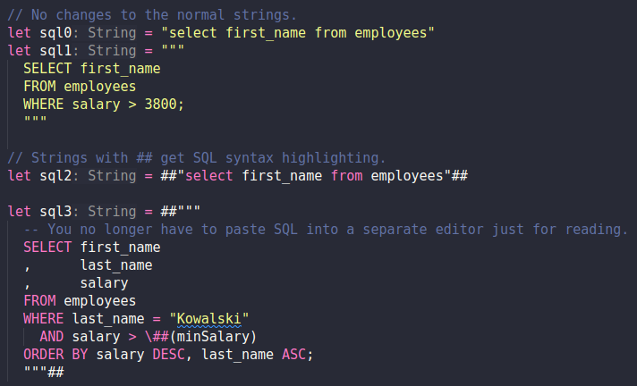

VSCode extensions that add embedded language syntax highlighting to [Swift #String literals](https://github.com/swiftlang/swift-evolution/blob/main/proposals/0200-raw-string-escaping.md#expanding-delimiters).

## [Swift+SQL #](TODO)

Adds SQL syntax highlighting to `#Strings`.


## [Swift+SQL ##](TODO)

Adds SQL syntax highlighting to `##Strings`.



## [Swift+HTML](TODO)

Adds HTML syntax highlighting to `#Strings`.


## Repository content

- `generate_extensions.js` - use this script to generate extensions for new languages
- `extension_sql_1_pound` - [Swift+SQL #](TODO) extension code
- `extension_sql_2_pounds` - [Swift+SQL ##](TODO) extension code
- `extension_html` - [Swift+HTML](TODO) extension code
- `test_files` - testing samples for the extensions


## Q&A

### Why "comment" keyboard shortcut inserts a Swift comment?

Pressing `⌘+/` (`Ctrl+/`) inserts a Swift comment (`//`) instead of the language specific comment (for example `-- ` for SQL). Workarounds:
- Type it manually
- Add a custom snippet - `⚙️ -> Snippets -> swift`:

  ```json
  "LANGUAGE_NAME_comment": {
    "prefix": "LANGUAGE_NAME_comment",
    "body": "COMMENT_SYNTAX"
  },
  ```

### Can you select the `#` count?

Ideally, we would have our own settings where users can select how `#` count corresponds to the highlighted language. For example:

|# count|Language|
|-------|--------|
| #     | HTML   |
| ##    | SQL    |
| ###   | GraphQL|

Unfortunately, changing the grammar file may fail the extension integrity check. See [Allow dynamic location of textmate grammar (vscode#68647)](https://github.com/microsoft/vscode/issues/68647) for details.

Workaround: publish multiple extensions, each with different `#` count, for example: `Swift+SQL #`, `Swift+SQL ##` etc.
