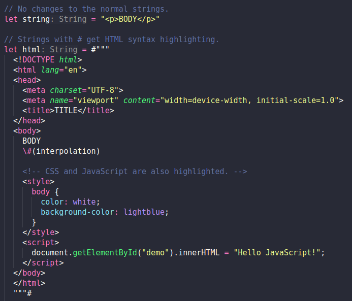

# Swift + HTML

This extension adds HTML syntax highlighting in `String` literals.



## Requirements

[The official Swift extension](https://marketplace.visualstudio.com/items?itemName=swiftlang.swift-vscode) is not required, but you probably want it anyway.

## Extension content

- HTML injection grammar (`syntaxes/injection.tmLanguage.json`) that adds syntax highlighting in `String` literals.

- Extension that overrides the `middleware.provideDocumentSemanticTokens` in the official Swift extension to remove the `tokenType` from `String` literals (other token types stay the same). This way the TextMate grammar (including our injection) will take over over.

## Known Issues

### Keyboard shortcut inserts a Swift comment

Pressing `⌘+/` (`Ctrl+/`) when writing HTML inserts a Swift comment: `//` instead of `<!-- $1 -->`. There is probably a way to avoid this using [Syntax Highlight Guide -> Injection grammars](https://code.visualstudio.com/api/language-extensions/syntax-highlight-guide#injection-grammars).

Workarounds:
- Type it manually
- Add a custom snippet - `⚙️ -> Snippets -> html`:

  ```json
  "Comment": {
    "prefix": "comment",
    "body": "<!-- $1 -->"
  },
  ```

### User defined `#` count

Ideally we would have our own settings where users can select how `#` count corresponds to the highlighted language. For example:

|# count|Language|
|-------|--------|
| #     | HTML   |
| ##    | SQL    |
| ###   | GraphQL|

Unfortunately changing the grammar file may fail the extension integrity check.
See [Allow dynamic location of textmate grammar (vscode#68647)](https://github.com/microsoft/vscode/issues/68647) for details.

Workaround: publish multiple extensions each with different `#` count, for example: `Swift+HTML#`, `Swift+HTML##` etc.
